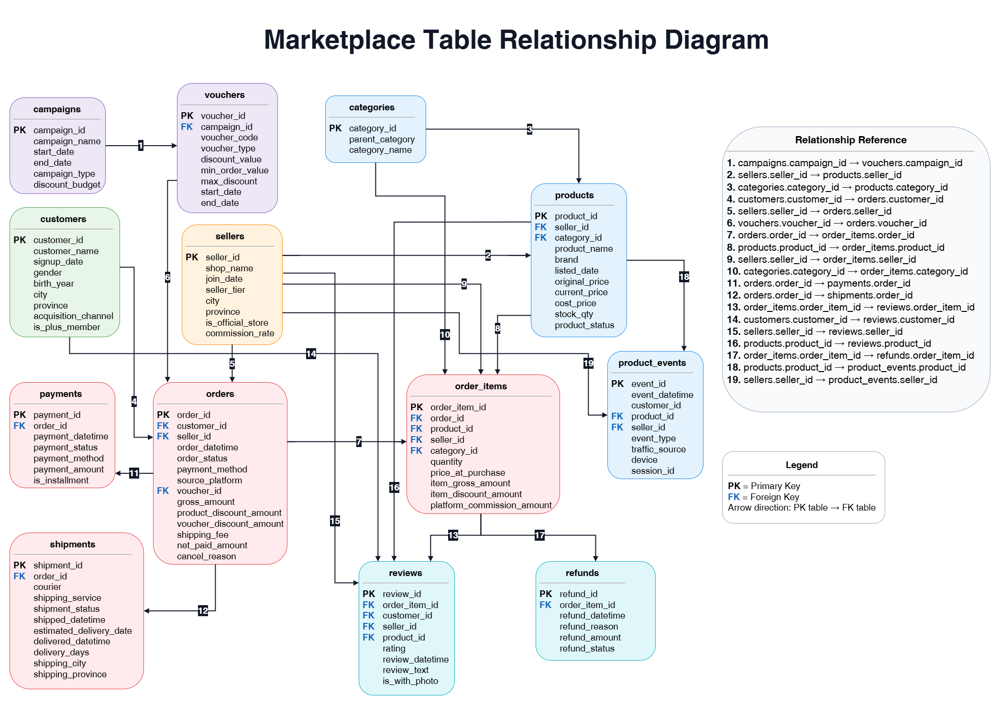

# Marketplace Analytics SQL Case Study

## Project Overview

This project is a PostgreSQL-based marketplace analytics case study using a fictional marketplace dataset. The objective is to demonstrate how SQL can be used to answer practical business questions commonly faced by marketplace, e-commerce, and digital product teams.

The analysis focuses on foundational marketplace metrics such as data scale, order status distribution, GMV, discounts, net paid amount, category performance, seller contribution, product demand, payment behavior, cancellation risk, monthly active buyers/sellers, and official-store performance.

## Dataset Structure

The dataset contains transaction, catalog, seller, customer, campaign, logistics, review, refund, and event data. The image below summarizes what is included in each table.


The simplified relationship map below shows the main analytical joins used in this project.



## Key Metric Definitions

| Metric | Definition |
|---|---|
| GMV | Gross merchandise value before discounts. In the `orders` table, this is represented by `gross_amount`. At item level, it can be calculated using `SUM(item_gross_amount)` or `SUM(price_at_purchase * quantity)`. |
| Product Discount | Discount applied directly to product/item price. |
| Voucher Discount | Discount funded through voucher or campaign mechanism. |
| Shipping Fee | Delivery fee charged to the buyer. This is added to the buyer's payment amount. |
| Net Paid Amount | Final buyer payment amount after discounts and shipping fee. Formula: `gross_amount - product_discount_amount - voucher_discount_amount + shipping_fee`. |
| AOV | Average order value. Formula: `GMV / order count`. |
| Units Sold | Total quantity of products sold. This should be calculated using `SUM(quantity)`, not `COUNT(order_id)` or `COUNT(order_item_id)`. |
| Cancellation Rate | Cancelled orders divided by total orders in the same segment. |
| Active Buyers | Unique customers with at least one completed order in a given period. |
| Active Sellers | Unique sellers with at least one completed order in a given period. |
| Completed Orders | Orders where `order_status = 'completed'`. These are used as the baseline for most revenue and sales analyses. |

## Important Analytical Assumptions

Revenue and sales analysis mainly uses completed orders because cancelled, pending, returned, or incomplete orders can distort GMV, AOV, and seller/product performance. GMV and net paid amount are treated as different concepts: GMV reflects merchandise value before discounts, while net paid amount reflects what the buyer actually pays after discounts and shipping fee. Product-level and seller-level analysis uses item-level data carefully because joining order-level and item-level tables can duplicate metrics when the grain is not handled properly.

## Analysis Questions, SQL Queries, Results, and Insights

Result tables below are shown as concise previews to keep the README readable. The full query can be run directly in PostgreSQL using the SQL files in this repository.

### 1. Count Rows in Every Table

This analysis profiles the scale of the marketplace dataset across each core entity, including transactions, customers, sellers, catalog, payments, logistics, reviews, refunds, campaigns, and behavior events. It matters because a strong analyst should first understand dataset coverage before interpreting performance metrics.

```sql
SELECT 'campaigns' AS table_name, COUNT(*) AS row_count FROM campaigns
UNION ALL SELECT 'categories', COUNT(*) FROM categories
UNION ALL SELECT 'customers', COUNT(*) FROM customers
UNION ALL SELECT 'orders', COUNT(*) FROM orders
UNION ALL SELECT 'order_items', COUNT(*) FROM order_items
UNION ALL SELECT 'payments', COUNT(*) FROM payments
UNION ALL SELECT 'product_events', COUNT(*) FROM product_events
UNION ALL SELECT 'products', COUNT(*) FROM products
UNION ALL SELECT 'refunds', COUNT(*) FROM refunds
UNION ALL SELECT 'reviews', COUNT(*) FROM reviews
UNION ALL SELECT 'sellers', COUNT(*) FROM sellers
UNION ALL SELECT 'shipments', COUNT(*) FROM shipments
UNION ALL SELECT 'vouchers', COUNT(*) FROM vouchers
ORDER BY table_name;
```

The `orders` table is included because it is the main transaction table. Removing it from profiling would make the dataset overview incomplete.

**Result preview**

| table_name     | row_count   |
|:---------------|:------------|
| campaigns      | 14          |
| categories     | 32          |
| customers      | 60,000      |
| order_items    | 424,097     |
| orders         | 250,000     |
| payments       | 250,000     |
| product_events | 1,000,000   |
| products       | 40,000      |
| refunds        | 16,517      |
| reviews        | 135,892     |
| sellers        | 4,000       |
| shipments      | 225,600     |
| vouchers       | 70          |

**Brief insight**

The dataset contains more than 2.4 million rows across 13 tables. `product_events` is the largest table with 1,000,000 rows, while `orders` and `payments` each contain 250,000 rows. This gives enough scale to practice joins, aggregation, and performance-aware SQL without using real company data.

### 2. Show Order Volume by Order Status and Month

This analysis shows how orders are distributed across statuses over time. It helps detect whether the marketplace is mostly generating completed transactions or whether operational issues appear through cancelled, pending, returned, or shipped-but-not-completed orders.

```sql
SELECT
    DATE_TRUNC('month', order_datetime)::date AS order_month,
    order_status,
    COUNT(*) AS order_count
FROM orders
GROUP BY 1, 2
ORDER BY 1, 2;
```

This query intentionally does not filter only completed orders because the purpose is to understand the full operational status distribution.

**Result preview**

**Status distribution summary**

| order_status   | orders   |   share_pct |
|:---------------|:---------|------------:|
| completed      | 205,170  |       82.07 |
| cancelled      | 20,380   |        8.15 |
| shipped        | 12,877   |        5.15 |
| returned       | 7,553    |        3.02 |
| pending        | 4,020    |        1.61 |

**Latest monthly status preview**

| order_month   | order_status   | order_count   |
|:--------------|:---------------|:--------------|
| 2026-01-01    | cancelled      | 630           |
| 2026-01-01    | completed      | 6,068         |
| 2026-01-01    | pending        | 121           |
| 2026-01-01    | returned       | 240           |
| 2026-01-01    | shipped        | 374           |
| 2026-02-01    | cancelled      | 909           |
| 2026-02-01    | completed      | 9,068         |
| 2026-02-01    | pending        | 196           |
| 2026-02-01    | returned       | 349           |
| 2026-02-01    | shipped        | 585           |
| 2026-03-01    | cancelled      | 1,249         |
| 2026-03-01    | completed      | 12,436        |
| 2026-03-01    | pending        | 214           |
| 2026-03-01    | returned       | 398           |
| 2026-03-01    | shipped        | 799           |
| 2026-04-01    | cancelled      | 573           |
| 2026-04-01    | completed      | 6,227         |
| 2026-04-01    | pending        | 116           |
| 2026-04-01    | returned       | 214           |
| 2026-04-01    | shipped        | 376           |
| 2026-05-01    | cancelled      | 786           |
| 2026-05-01    | completed      | 7,715         |
| 2026-05-01    | pending        | 158           |
| 2026-05-01    | returned       | 271           |
| 2026-05-01    | shipped        | 510           |

**Brief insight**

Completed orders dominate the platform at 82.07% of total orders, while cancelled orders account for 8.15%. This suggests the marketplace is mostly converting orders successfully, but cancellation remains large enough to deserve further investigation by payment method, source platform, seller, or category.

### 3. Calculate Monthly GMV, Net Paid Amount, Product Discount, Voucher Discount, and Shipping Fee

This analysis summarizes monthly commercial performance by separating GMV, product discount, voucher discount, shipping fee, and net paid amount. It matters because GMV and buyer payment are different business concepts, and mixing them can lead to wrong conclusions about revenue, discount burn, and marketplace value.

```sql
SELECT
    DATE_TRUNC('month', order_datetime)::date AS order_month,
    SUM(gross_amount) AS gmv,
    SUM(product_discount_amount) AS product_discount_total,
    SUM(voucher_discount_amount) AS voucher_discount_total,
    SUM(shipping_fee) AS shipping_fee_total,
    SUM(net_paid_amount) AS net_paid_total,
    SUM(
        gross_amount
        - product_discount_amount
        - voucher_discount_amount
        + shipping_fee
    ) AS recalculated_net_paid,
    SUM(net_paid_amount)
    - SUM(
        gross_amount
        - product_discount_amount
        - voucher_discount_amount
        + shipping_fee
    ) AS net_paid_difference
FROM orders
WHERE order_status = 'completed'
GROUP BY 1
ORDER BY 1;
```

Net paid amount is validated using `gross_amount - product_discount_amount - voucher_discount_amount + shipping_fee`. Shipping fee is added because it is part of the buyer's final payment.

**Result preview**

| order_month   | gmv            | product_discount_total   | voucher_discount_total   | shipping_fee_total   | net_paid_total   | recalculated_net_paid   |   net_paid_difference |
|:--------------|:---------------|:-------------------------|:-------------------------|:---------------------|:-----------------|:------------------------|----------------------:|
| 2026-01-01    | 12,599,214,000 | 308,709,880              | 0                        | 76,897,000           | 12,367,401,120   | 12,367,401,120          |                     0 |
| 2026-02-01    | 19,126,648,000 | 1,171,532,640            | 114,738,809              | 115,250,000          | 17,955,626,551   | 17,955,626,551          |                     0 |
| 2026-03-01    | 25,917,835,000 | 1,601,350,860            | 165,512,656              | 158,482,000          | 24,309,453,484   | 24,309,453,484          |                     0 |
| 2026-04-01    | 13,382,138,000 | 319,876,810              | 0                        | 79,256,000           | 13,141,517,190   | 13,141,517,190          |                     0 |
| 2026-05-01    | 16,588,962,000 | 831,688,310              | 94,612,828               | 99,040,000           | 15,761,700,862   | 15,761,700,862          |                     0 |

**Brief insight**

Across completed orders, total GMV reaches 430,792,971,000, while total net paid amount reaches 411,901,598,002. Product discounts (20,099,242,320) are much larger than voucher discounts (1,406,947,678), which suggests that product-level discounting is the bigger discount lever in this dataset. The validation difference is 0, confirming that the net paid formula is consistent.

### 4. Find Top 20 Categories by Completed GMV and Units Sold

This analysis identifies the categories generating the highest completed GMV and product units sold. It supports category prioritization, campaign planning, seller acquisition focus, and merchandising decisions.

```sql
SELECT
    c.category_id,
    c.parent_category,
    c.category_name,
    SUM(oi.quantity) AS units_sold,
    COUNT(DISTINCT o.order_id) AS completed_orders,
    SUM(oi.item_gross_amount) AS gmv
FROM order_items oi
JOIN categories c
    ON oi.category_id = c.category_id
JOIN orders o
    ON oi.order_id = o.order_id
WHERE o.order_status = 'completed'
GROUP BY 1, 2, 3
ORDER BY gmv DESC, units_sold DESC
LIMIT 20;
```

Units sold must use `SUM(oi.quantity)`, not `COUNT(oi.quantity)`. Counting quantity only counts item rows, while summing quantity counts actual units sold.

**Result preview**

| category_id   | parent_category   | category_name       | units_sold   | completed_orders   | gmv             |
|:--------------|:------------------|:--------------------|:-------------|:-------------------|:----------------|
| CAT004        | Electronics       | Computers & Laptops | 13,823       | 9,332              | 172,408,752,000 |
| CAT001        | Electronics       | Smartphones         | 12,912       | 8,648              | 70,690,224,000  |
| CAT015        | Home & Living     | Furniture           | 13,619       | 9,165              | 30,257,522,000  |
| CAT003        | Electronics       | Home Appliances     | 13,500       | 9,131              | 19,973,004,000  |
| CAT012        | Beauty            | Fragrance           | 22,768       | 15,250             | 12,469,337,000  |

**Brief insight**

Computers & Laptops is the strongest category by GMV, followed by Smartphones. Some categories such as Fragrance, Bags, and Shoes generate high unit volume but lower GMV than electronics, showing why units sold and GMV should be interpreted separately.

### 5. Find Top 20 Sellers by Completed GMV and Marketplace Commission

This analysis identifies sellers that contribute the most completed GMV and marketplace commission. It is useful for seller management because high-value sellers may require retention support, account management, operational monitoring, or partnership treatment.

```sql
SELECT
    s.seller_id,
    s.shop_name,
    s.seller_tier,
    COUNT(DISTINCT o.order_id) AS completed_orders,
    SUM(oi.quantity) AS units_sold,
    SUM(oi.item_gross_amount) AS gmv,
    SUM(oi.platform_commission_amount) AS marketplace_commission
FROM order_items oi
JOIN sellers s
    ON oi.seller_id = s.seller_id
JOIN orders o
    ON oi.order_id = o.order_id
WHERE o.order_status = 'completed'
GROUP BY 1, 2, 3
ORDER BY gmv DESC, marketplace_commission DESC
LIMIT 20;
```

GMV is calculated from item-level data using `SUM(oi.item_gross_amount)` to avoid duplicating order-level values when working at seller level.

**Result preview**

| seller_id   | shop_name          | seller_tier   |   completed_orders |   units_sold | gmv           | marketplace_commission   |
|:------------|:-------------------|:--------------|-------------------:|-------------:|:--------------|:-------------------------|
| S00721      | Sinar House 721    | Silver        |                 57 |          152 | 1,551,820,000 | 87,218,641               |
| S01581      | Murah Tech 1581    | Silver        |                 52 |          129 | 1,074,377,000 | 47,249,443               |
| S00852      | Global Gallery 852 | Silver        |                 79 |          214 | 1,023,008,000 | 57,155,455               |
| S00900      | Prima Gallery 900  | Silver        |                 61 |          162 | 974,264,000   | 53,300,364               |
| S02936      | Global House 2936  | Bronze        |                 68 |          190 | 966,312,000   | 46,579,689               |

**Brief insight**

The top sellers are concentrated mostly in Silver and Bronze tiers. The highest-GMV seller generated over 1.55 billion in completed item GMV, but the ranking also shows that strong seller value can come from relatively small order counts when the seller carries higher-ticket products.

### 6. Find Top 20 Products by Units Sold

This analysis finds the strongest products by actual units sold. It helps identify high-demand products for inventory planning, campaign promotion, seller support, and product recommendation strategy.

```sql
SELECT
    p.product_id,
    p.product_name,
    SUM(oi.quantity) AS units_sold,
    COUNT(DISTINCT o.order_id) AS completed_orders,
    SUM(oi.item_gross_amount) AS gmv
FROM order_items oi
JOIN products p
    ON oi.product_id = p.product_id
JOIN orders o
    ON oi.order_id = o.order_id
WHERE o.order_status = 'completed'
GROUP BY 1, 2
ORDER BY units_sold DESC, gmv DESC
LIMIT 20;
```

The important correction is to use `SUM(oi.quantity)` for product sold quantity. A single order item row can represent more than one unit.

**Result preview**

| product_id   | product_name                      |   units_sold |   completed_orders | gmv       |
|:-------------|:----------------------------------|-------------:|-------------------:|:----------|
| P0020067     | Tupperware Kitchenware Item 20067 |          167 |                 49 | 5,845,000 |
| P0007794     | Scarlett Skincare Item 7794       |           72 |                 42 | 3,600,000 |
| P0012128     | Wings Fresh Food Item 12128       |           72 |                 37 | 936,000   |
| P0036893     | Unilever Fresh Food Item 36893    |           70 |                 36 | 5,460,000 |
| P0039271     | Berrybenka Bags Item 39271        |           69 |                 40 | 6,624,000 |

**Brief insight**

The highest-unit product sold 167 units, but its GMV is much lower than some products with fewer units. This reinforces that top products by quantity are not always the same as top products by revenue.

### 7. Calculate AOV by Payment Method and Source Platform

This analysis compares average order value across payment methods and source platforms. It helps reveal differences in customer behavior, transaction size, payment preference, and platform-level monetization quality.

```sql
SELECT
    payment_method,
    source_platform,
    COUNT(*) AS completed_orders,
    SUM(gross_amount) AS gmv,
    ROUND(
        SUM(gross_amount) / NULLIF(COUNT(*), 0),
        2
    ) AS aov
FROM orders
WHERE order_status = 'completed'
GROUP BY 1, 2
ORDER BY source_platform, payment_method;
```

`AVG(gross_amount)` would work at pure order grain, but `SUM(gross_amount) / COUNT(*)` makes the business definition clearer: AOV equals GMV divided by completed order count.

**Result preview**

| payment_method   | source_platform   | completed_orders   | gmv            | aov          |
|:-----------------|:------------------|:-------------------|:---------------|:-------------|
| Virtual Account  | ios               | 2,359              | 5,906,563,000  | 2,503,841.88 |
| Bank Transfer    | android           | 24,138             | 53,045,607,000 | 2,197,597.44 |
| PayLater         | ios               | 4,037              | 8,778,281,000  | 2,174,456.53 |
| COD              | web               | 3,956              | 8,425,196,000  | 2,129,725.99 |
| QRIS             | android           | 7,161              | 15,235,308,000 | 2,127,539.17 |
| COD              | android           | 27,362             | 58,154,906,000 | 2,125,389.45 |

**Brief insight**

The highest AOV appears in iOS Virtual Account transactions, but the order count is relatively small. Android Bank Transfer combines high AOV with much larger volume, making it more commercially meaningful than a small-volume high-AOV segment.

### 8. Calculate Cancellation Rate by Payment Method and Source Platform

This analysis identifies payment methods and source platforms with higher cancellation risk. It helps narrow down where the business should investigate checkout friction, payment failure, UX issues, buyer behavior, or operational problems.

```sql
SELECT
    payment_method,
    source_platform,
    COUNT(*) AS total_orders,
    COUNT(*) FILTER (
        WHERE order_status = 'cancelled'
    ) AS cancelled_orders,
    ROUND(
        100.0
        * COUNT(*) FILTER (WHERE order_status = 'cancelled')
        / NULLIF(COUNT(*), 0),
        2
    ) AS cancellation_rate_pct
FROM orders
GROUP BY 1, 2
ORDER BY cancellation_rate_pct DESC, total_orders DESC;
```

Cancellation should be analyzed as a rate, not only as raw cancelled order count. A segment with more orders may naturally have more cancellations, so percentage-based comparison is fairer.

**Result preview**

| payment_method   | source_platform   | total_orders   | cancelled_orders   |   cancellation_rate_pct |
|:-----------------|:------------------|:---------------|:-------------------|------------------------:|
| Virtual Account  | web               | 1,483          | 139                |                    9.37 |
| COD              | android           | 33,171         | 2,993              |                    9.02 |
| COD              | web               | 4,808          | 428                |                    8.9  |
| QRIS             | ios               | 2,455          | 212                |                    8.64 |
| COD              | ios               | 9,422          | 801                |                    8.5  |
| QRIS             | android           | 8,749          | 722                |                    8.25 |

**Brief insight**

The highest cancellation rate appears in web Virtual Account transactions at 9.37%, while COD also appears repeatedly among high-cancellation segments. This points to payment flow and checkout behavior as useful next areas for root-cause analysis.

### 9. Calculate Monthly Active Buyers and Monthly Active Sellers

This analysis tracks active demand and active supply in the marketplace by month. Active buyers represent customer purchasing activity, while active sellers represent supply-side participation in successful transactions.

```sql
SELECT
    DATE_TRUNC('month', order_datetime)::date AS order_month,
    COUNT(DISTINCT customer_id) AS active_buyers,
    COUNT(DISTINCT seller_id) AS active_sellers
FROM orders
WHERE order_status = 'completed'
GROUP BY 1
ORDER BY 1;
```

This query defines activity based on completed orders. A buyer or seller is only counted as active if they participated in at least one successful transaction in the month.

**Result preview**

| order_month   | active_buyers   | active_sellers   |
|:--------------|:----------------|:-----------------|
| 2025-12-01    | 7,613           | 3,494            |
| 2026-01-01    | 5,784           | 3,126            |
| 2026-02-01    | 8,415           | 3,622            |
| 2026-03-01    | 11,245          | 3,819            |
| 2026-04-01    | 5,923           | 3,183            |
| 2026-05-01    | 7,213           | 3,422            |

**Brief insight**

Monthly active buyers and sellers both peak in March 2026 in the preview period. The simultaneous increase in buyer and seller activity suggests stronger marketplace liquidity during that month, which may be linked to campaign or seasonal effects.

### 10. Compare Official Store vs Non-Official Store Performance

This analysis compares official and non-official stores across active sellers, completed orders, units sold, GMV, marketplace commission, and AOV. It helps evaluate whether official-store status is associated with stronger commercial performance or seller productivity.

```sql
SELECT
    DATE_TRUNC('month', o.order_datetime)::date AS order_month,
    CASE
        WHEN s.is_official_store = TRUE THEN 'official'
        ELSE 'non_official'
    END AS store_type,
    COUNT(DISTINCT oi.seller_id) AS active_sellers,
    COUNT(DISTINCT o.order_id) AS completed_orders,
    SUM(oi.quantity) AS units_sold,
    SUM(oi.item_gross_amount) AS gmv,
    SUM(oi.platform_commission_amount) AS marketplace_commission,
    ROUND(
        SUM(oi.item_gross_amount)
        / NULLIF(COUNT(DISTINCT o.order_id), 0),
        2
    ) AS aov
FROM order_items oi
JOIN sellers s
    ON oi.seller_id = s.seller_id
JOIN orders o
    ON oi.order_id = o.order_id
WHERE o.order_status = 'completed'
GROUP BY 1, 2
ORDER BY 1, 2;
```

Because this query joins `orders` and `order_items`, order count must use `COUNT(DISTINCT o.order_id)` to avoid duplicate orders. Units sold should use `SUM(oi.quantity)` because item rows do not always equal product units.

**Result preview**

**Latest monthly preview**

| order_month   | store_type   | active_sellers   | completed_orders   | units_sold   | gmv            | marketplace_commission   | aov          |
|:--------------|:-------------|:-----------------|:-------------------|:-------------|:---------------|:-------------------------|:-------------|
| 2026-03-01    | non_official | 3,319            | 10,812             | 26,712       | 22,848,588,000 | 1,055,498,611            | 2,113,261.93 |
| 2026-03-01    | official     | 500              | 1,624              | 3,953        | 3,069,247,000  | 192,557,135              | 1,889,930.42 |
| 2026-04-01    | non_official | 2,751            | 5,376              | 13,350       | 11,916,460,000 | 573,541,891              | 2,216,603.42 |
| 2026-04-01    | official     | 432              | 851                | 2,058        | 1,465,678,000  | 97,657,914               | 1,722,300.82 |
| 2026-05-01    | non_official | 2,963            | 6,685              | 16,150       | 14,251,455,000 | 658,660,890              | 2,131,855.65 |
| 2026-05-01    | official     | 459              | 1,030              | 2,432        | 2,337,507,000  | 145,452,165              | 2,269,424.27 |

**Overall store-type comparison**

| store_type   | active_sellers   | completed_orders   | units_sold   | gmv             | marketplace_commission   | aov          |
|:-------------|:-----------------|:-------------------|:-------------|:----------------|:-------------------------|:-------------|
| non_official | 3,468            | 177,877            | 437,943      | 378,112,383,000 | 17,707,903,156           | 2,125,695.75 |
| official     | 532              | 27,293             | 66,705       | 52,680,588,000  | 3,444,363,216            | 1,930,186.79 |

**Brief insight**

Non-official stores contribute most of the GMV and order volume because they have far more active sellers. However, official stores still represent a meaningful GMV contribution despite a smaller seller base. The overall AOV is higher for non-official stores in this dataset, so the data does not support a blanket assumption that official stores always drive higher order value.

## Review Notes from Query Revision

The submitted SQL logic was generally on the right track, but several corrections were needed before publishing. Debug statements were removed, the `orders` table was added to row-count profiling, `COUNT(quantity)` was replaced with `SUM(quantity)`, AOV was written explicitly as `GMV / order count`, and order counts after item-level joins were changed to `COUNT(DISTINCT order_id)` where needed.

## Analytical Learnings

This project highlights that SQL analysis is not only about writing syntactically correct queries. Good marketplace analytics requires choosing the right metric grain, separating GMV from net paid amount, avoiding duplicated order-level values after joins, using completed orders for clean commercial baselines, calculating units sold from quantity, and comparing operational issues with rates rather than raw counts.

## Repository Structure

```text
marketplace-sql-analytics-case-study/
│
├── README.md
├── assets/
│   ├── marketplace_table_overview.png
│   └── marketplace_table_relationship_map.png
│
├── sql/
│   ├── 01_10_foundational_marketplace_analysis.sql
│   └── individual_query_files.sql
│
└── outputs/
    └── screenshots/
```

## Portfolio Positioning

This project demonstrates my ability to use SQL not only for data extraction, but also for business analysis. The queries are designed to answer practical marketplace questions, define relevant KPIs, handle relational data correctly, and avoid common analytical mistakes such as double-counting, incorrect denominator selection, and confusion between order-level and item-level metrics.
