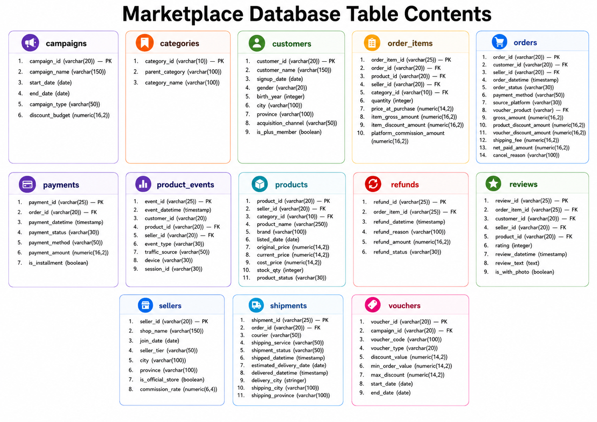

# Marketplace Analytics SQL Case Study

## Project Overview

This project is a PostgreSQL-based marketplace analytics case study using a fictional marketplace dataset. The objective is to demonstrate how SQL can be used to answer practical business questions commonly faced by marketplace, e-commerce, and digital product teams.

The analysis focuses on foundational marketplace metrics such as data scale, order status distribution, GMV, discounts, net paid amount, category performance, seller contribution, product demand, payment behavior, cancellation risk, monthly active buyers/sellers, and official-store performance.

## Dataset Structure

The dataset contains transaction, catalog, seller, customer, campaign, logistics, review, refund, and event data. The image below summarizes what is included in each table.



The simplified relationship map below shows the main analytical joins used in this project.


## Key Metric Definitions

| Metric | Definition |
|---|---|
| GMV | Gross merchandise value before discounts. In the `orders` table, this is represented by `gross_amount`. At item level, it can be calculated using `SUM(item_gross_amount)` or `SUM(price_at_purchase * quantity)`. |
| Product Discount | Discount applied directly to product/item price. |
| Voucher Discount | Discount funded through voucher or campaign mechanism. |
| Shipping Fee | Delivery fee charged to the buyer. This is added to the buyer's payment amount. |
| Net Paid Amount | Final buyer payment amount after discounts and shipping fee. Formula: `gross_amount - product_discount_amount - voucher_discount_amount + shipping_fee`. |
| AOV | Average order value. Formula: `GMV / order count`. |
| Units Sold | Total quantity of products sold. This should be calculated using `SUM(quantity)`, not `COUNT(order_id)` or `COUNT(order_item_id)`. |
| Cancellation Rate | Cancelled orders divided by total orders in the same segment. |
| Active Buyers | Unique customers with at least one completed order in a given period. |
| Active Sellers | Unique sellers with at least one completed order in a given period. |
| Completed Orders | Orders where `order_status = 'completed'`. These are used as the baseline for most revenue and sales analyses. |

## Important Analytical Assumptions

Revenue and sales analysis mainly uses completed orders because cancelled, pending, returned, or incomplete orders can distort GMV, AOV, and seller/product performance. GMV and net paid amount are treated as different concepts: GMV reflects merchandise value before discounts, while net paid amount reflects what the buyer actually pays after discounts and shipping fee. Product-level and seller-level analysis uses item-level data carefully because joining order-level and item-level tables can duplicate metrics when the grain is not handled properly.

## Analysis Questions, SQL Queries, Results, and Insights

The result tables below are concise previews generated from the same fictional marketplace dataset. The column names in each result preview match the SQL aliases shown in the query.

### 1. Count Rows in Every Table

This query profiles the number of rows in every major marketplace table. It is important because the first analytical step is understanding which tables are transaction-heavy and which tables are smaller dimensions.

```sql
SELECT 'campaigns' AS table_name, COUNT(*) AS row_number FROM campaigns
UNION ALL SELECT 'categories', COUNT(*) FROM categories
UNION ALL SELECT 'customers', COUNT(*) FROM customers
UNION ALL SELECT 'orders', COUNT(*) FROM orders
UNION ALL SELECT 'order_items', COUNT(*) FROM order_items
UNION ALL SELECT 'payments', COUNT(*) FROM payments
UNION ALL SELECT 'product_events', COUNT(*) FROM product_events
UNION ALL SELECT 'products', COUNT(*) FROM products
UNION ALL SELECT 'refunds', COUNT(*) FROM refunds
UNION ALL SELECT 'reviews', COUNT(*) FROM reviews
UNION ALL SELECT 'sellers', COUNT(*) FROM sellers
UNION ALL SELECT 'shipments', COUNT(*) FROM shipments
UNION ALL SELECT 'vouchers', COUNT(*) FROM vouchers;
```

**Result preview**

| table_name     | row_number   |
|:---------------|:-------------|
| campaigns      | 14           |
| categories     | 32           |
| customers      | 60,000       |
| orders         | 250,000      |
| order_items    | 424,097      |
| payments       | 250,000      |
| product_events | 1,000,000    |
| products       | 40,000       |
| refunds        | 16,517       |
| reviews        | 135,892      |
| sellers        | 4,000        |
| shipments      | 225,600      |
| vouchers       | 70           |

**Brief insight**

The dataset contains more than 2.4 million rows across 13 tables. `product_events` is the largest table with 1,000,000 rows, while `orders` and `payments` each contain 250,000 rows. Event-level and transaction-level analyses will therefore be the heaviest parts of the database.

### 2. Show Order Volume by Order Status and Month

This query shows order volume by monthly period and `order_status`. It helps identify whether most orders are completed or whether operational issues appear through cancelled, pending, returned, or shipped statuses.

```sql
SELECT
    DATE_TRUNC('month', order_datetime) AS order_month,
    order_status,
    COUNT(order_id) AS order_count
FROM orders
GROUP BY 2, 1
ORDER BY 2, 1 ASC;
```

This query intentionally does not filter only completed orders because the purpose is to understand the full operational status distribution.


**Result Preview: Overall Status Distribution**

| order_status   | order_count   |   share_pct |
|:---------------|:--------------|------------:|
| completed      | 205,170       |       82.07 |
| cancelled      | 20,380        |        8.15 |
| shipped        | 12,877        |        5.15 |
| returned       | 7,553         |        3.02 |
| pending        | 4,020         |        1.61 |

**Result preview: latest monthly rows**

| order_month   | order_status   | order_count   |
|:--------------|:---------------|:--------------|
| 2026-04-01    | cancelled      | 573           |
| 2026-04-01    | completed      | 6,227         |
| 2026-04-01    | pending        | 116           |
| 2026-04-01    | returned       | 214           |
| 2026-04-01    | shipped        | 376           |
| 2026-05-01    | cancelled      | 786           |
| 2026-05-01    | completed      | 7,715         |
| 2026-05-01    | pending        | 158           |
| 2026-05-01    | returned       | 271           |
| 2026-05-01    | shipped        | 510           |

**Brief insight**

Completed orders dominate the marketplace at 82.07% of total order, but cancellation remains a meaningful share of total orders, account for 8.15%. This makes cancellation a valid follow-up area for payment, platform, seller, or fulfillment analysis.

### 3. Calculate Monthly GMV, Net Paid Amount, Product Discount, Voucher Discount, and Shipping Fee

This query summarizes completed-order commercial performance by month. It separates GMV, shipping fee, product discount, voucher discount, and net paid amount so that sales value and buyer-paid value are not confused.

```sql
SELECT 
    DATE_TRUNC('month', order_datetime) AS order_month,
    SUM(gross_amount) AS gmv,
    SUM(shipping_fee) AS shipping_fee_total,
    SUM(product_discount_amount) AS product_discount_total,
    SUM(voucher_discount_amount) AS voucher_discount_total,
    SUM(net_paid_amount) AS net_paid_total
FROM orders
WHERE order_status = 'completed'
GROUP BY 1
ORDER BY 1;
```

**Result Preview**

| order_month   | gmv            | shipping_fee_total   | product_discount_total   | voucher_discount_total   | net_paid_total   |
|:--------------|:---------------|:---------------------|:-------------------------|:-------------------------|:-----------------|
| 2026-01-01    | 12,599,214,000 | 76,897,000           | 308,709,880              | 0                        | 12,367,401,120   |
| 2026-02-01    | 19,126,648,000 | 115,250,000          | 1,171,532,640            | 114,738,809              | 17,955,626,551   |
| 2026-03-01    | 25,917,835,000 | 158,482,000          | 1,601,350,860            | 165,512,656              | 24,309,453,484   |
| 2026-04-01    | 13,382,138,000 | 79,256,000           | 319,876,810              | 0                        | 13,141,517,190   |
| 2026-05-01    | 16,588,962,000 | 99,040,000           | 831,688,310              | 94,612,828               | 15,761,700,862   |

**Brief insight**

Across completed orders, total GMV reaches 430,792,971,000, while total net paid amount reaches 411,901,598,002. Product discounts (20,099,242,320) are much larger than voucher discounts (1,406,947,678), which suggests that product-level discounting is the bigger discount lever in this dataset. The validation difference is 0, confirming that the net paid formula is consistent.

### 4. Find Top 20 Categories by Completed GMV and Units Sold

This query ranks categories by completed GMV and units sold. It supports category prioritization, campaign planning, seller acquisition, and merchandising decisions.

```sql
SELECT
    c.category_id,
    c.parent_category,
    c.category_name,
    SUM(oi.quantity) AS units_sold,
    SUM(oi.item_gross_amount) AS gmv
FROM order_items oi
JOIN categories c
    ON oi.category_id = c.category_id
JOIN orders o
    ON oi.order_id = o.order_id
WHERE o.order_status = 'completed'
GROUP BY 1, 2, 3
ORDER BY 5 DESC, 4 DESC
LIMIT 20;
```

**Result preview**

| category_id   | parent_category   | category_name       | units_sold   | gmv             |
|:--------------|:------------------|:--------------------|:-------------|:----------------|
| CAT004        | Electronics       | Computers & Laptops | 13,823       | 172,408,752,000 |
| CAT001        | Electronics       | Smartphones         | 12,912       | 70,690,224,000  |
| CAT015        | Home & Living     | Furniture           | 13,619       | 30,257,522,000  |
| CAT003        | Electronics       | Home Appliances     | 13,500       | 19,973,004,000  |
| CAT012        | Beauty            | Fragrance           | 22,768       | 12,469,337,000  |

**Brief insight**

Computers & Laptops is the strongest category by GMV, followed by Smartphones. Some categories such as Fragrance, Bags, and Shoes generate high unit volume but lower GMV than electronics, showing why units sold and GMV should be interpreted separately.

### 5. Find Top 20 Sellers by Completed GMV and Marketplace Commission

This query ranks sellers by completed GMV and marketplace commission. It helps identify high-value sellers that may deserve retention support, account management, or operational monitoring.

```sql
SELECT
    s.seller_id,
    s.shop_name,
    s.seller_tier,
    SUM(oi.item_gross_amount) AS gmv,
    SUM(oi.platform_commission_amount) AS marketplace_commission
FROM order_items oi
JOIN sellers s
    ON oi.seller_id = s.seller_id
JOIN orders o
    ON oi.order_id = o.order_id
WHERE o.order_status = 'completed'
GROUP BY 1, 2, 3
ORDER BY 4 DESC, 5 DESC
LIMIT 20;
```

**Result preview**

| seller_id   | shop_name          | seller_tier   | gmv           | marketplace_commission   |
|:------------|:-------------------|:--------------|:--------------|:-------------------------|
| S00721      | Sinar House 721    | Silver        | 1,551,820,000 | 87,218,641               |
| S01581      | Murah Tech 1581    | Silver        | 1,074,377,000 | 47,249,443               |
| S00852      | Global Gallery 852 | Silver        | 1,023,008,000 | 57,155,455               |
| S00900      | Prima Gallery 900  | Silver        | 974,264,000   | 53,300,364               |
| S02936      | Global House 2936  | Bronze        | 966,312,000   | 46,579,689               |

**Brief insight**

The top sellers are concentrated mostly in Silver and Bronze tiers. The highest-GMV seller generated over 1.55 billion in completed item GMV, but the ranking also shows that strong seller value can come from relatively small order counts when the seller carries higher-ticket products.

### 6. Find Top 20 Products by Units Sold

This query ranks products by total units sold. It is useful for identifying high-demand products for inventory monitoring, campaign promotion, and recommendation support.

```sql
SELECT
    p.product_id,
    p.product_name,
    SUM(oi.quantity) AS unit_sold,
    SUM(oi.item_gross_amount) AS gmv
FROM order_items oi
JOIN products p
    ON oi.product_id = p.product_id
JOIN orders o
    ON oi.order_id = o.order_id
WHERE o.order_status = 'completed'
GROUP BY 1, 2
ORDER BY 3 DESC, 4 DESC
LIMIT 20;
```

**Result preview**

| product_id   | product_name                      |   unit_sold | gmv       |
|:-------------|:----------------------------------|------------:|:----------|
| P0020067     | Tupperware Kitchenware Item 20067 |         167 | 5,845,000 |
| P0007794     | Scarlett Skincare Item 7794       |          72 | 3,600,000 |
| P0012128     | Wings Fresh Food Item 12128       |          72 | 936,000   |
| P0036893     | Unilever Fresh Food Item 36893    |          70 | 5,460,000 |
| P0039271     | Berrybenka Bags Item 39271        |          69 | 6,624,000 |

**Brief insight**

The highest-unit product sold 167 units, but its GMV is much lower than some products with fewer units. This reinforces that top products by quantity are not always the same as top products by revenue.

### 7. Calculate AOV by Payment Method and Source Platform

This query calculates AOV by `payment_method` and `source_platform`. It helps identify payment-platform combinations associated with higher-value completed orders.

```sql
SELECT 
    payment_method,
    source_platform,
    AVG(gross_amount) AS aov
FROM orders
WHERE order_status = 'completed'
GROUP BY 1, 2
ORDER BY 2, 1;
```

**Result preview**

| payment_method   | source_platform   | aov          |
|:-----------------|:------------------|:-------------|
| Bank Transfer    | android           | 2,197,597.44 |
| COD              | android           | 2,125,389.45 |
| Credit Card      | android           | 2,107,849.65 |
| PayLater         | android           | 2,062,562.42 |
| QRIS             | android           | 2,127,539.17 |
| ShopeePay        | android           | 2,086,370.75 |
| Virtual Account  | android           | 2,050,887.57 |
| Bank Transfer    | ios               | 2,014,224.52 |

**Brief insight**

The highest AOV appears in iOS Virtual Account transactions, but the order count is relatively small. Android Bank Transfer combines high AOV with much larger volume, making it more commercially meaningful than a small-volume high-AOV segment.

### 8. Calculate Cancellation Rate by Payment Method and Source Platform

This query calculates cancellation rate by `payment_method` and `source_platform`. It helps identify where checkout friction, payment failure, or user behavior issues may be concentrated.

```sql
SELECT 
    payment_method,
    source_platform,
    COUNT(*) FILTER (WHERE order_status = 'cancelled') AS cancel_orders,
    COUNT(*) AS total_orders,
    ROUND(
        100.0 * COUNT(*) FILTER (WHERE order_status = 'cancelled')
        / COUNT(*),
        2
    ) AS cancel_rate
FROM orders
GROUP BY 1, 2
ORDER BY 5 DESC, 2, 1;
```

**Result preview**

| payment_method   | source_platform   | cancel_orders   | total_orders   |   cancel_rate |
|:-----------------|:------------------|:----------------|:---------------|--------------:|
| Virtual Account  | web               | 139             | 1,483          |          9.37 |
| COD              | android           | 2,993           | 33,171         |          9.02 |
| COD              | web               | 428             | 4,808          |          8.9  |
| QRIS             | ios               | 212             | 2,455          |          8.64 |
| COD              | ios               | 801             | 9,422          |          8.5  |
| QRIS             | android           | 722             | 8,749          |          8.25 |

**Brief insight**

The highest cancellation rate appears in web Virtual Account transactions at 9.37%, while COD also appears repeatedly among high-cancellation segments. This points to payment flow and checkout behavior as useful next areas for root-cause analysis.

### 9. Calculate Monthly Active Buyers and Monthly Active Sellers

This query calculates monthly active buyers and active sellers using completed orders. It gives a basic view of demand-side and supply-side marketplace activity over time.

```sql
SELECT
    DATE_TRUNC('month', order_datetime) AS order_month,
    COUNT(DISTINCT customer_id) AS active_buyers,
    COUNT(DISTINCT seller_id) AS active_sellers
FROM orders
WHERE order_status = 'completed'
GROUP BY 1
ORDER BY 1;
```

**Result preview**

| order_month   | active_buyers   | active_sellers   |
|:--------------|:----------------|:-----------------|
| 2025-12-01    | 7,613           | 3,494            |
| 2026-01-01    | 5,784           | 3,126            |
| 2026-02-01    | 8,415           | 3,622            |
| 2026-03-01    | 11,245          | 3,819            |
| 2026-04-01    | 5,923           | 3,183            |
| 2026-05-01    | 7,213           | 3,422            |

**Brief insight**

Monthly active buyers and sellers both peak in March 2026 in the preview period. The simultaneous increase in buyer and seller activity suggests stronger marketplace liquidity during that month, which may be linked to campaign or seasonal effects.

### 10. Compare Official Store vs Non-Official Store Performance

This query compares official and not-official stores by active stores, completed orders, goods sold, GMV, and marketplace commission. It helps evaluate whether official-store status is associated with stronger commercial performance.

```sql
SELECT
    DATE_TRUNC('month', o.order_datetime) AS order_month,
    CASE 
        WHEN s.is_official_store = TRUE THEN 'official'
        ELSE 'not official'
    END AS official_store,
    COUNT(DISTINCT oi.seller_id) AS store_active,
    COUNT(DISTINCT o.order_id) AS order_complete,
    SUM(oi.quantity) AS goods_sold,
    SUM(oi.item_gross_amount) AS gmv,
    SUM(oi.platform_commission_amount) AS marketplace_commission
FROM order_items oi
JOIN sellers s
    ON oi.seller_id = s.seller_id
JOIN orders o
    ON oi.order_id = o.order_id
WHERE o.order_status = 'completed'
GROUP BY 1, 2
ORDER BY 1, 2;
```

**Result preview: latest monthly rows**

| order_month   | official_store   | store_active   | order_complete   | goods_sold   | gmv            | marketplace_commission   |
|:--------------|:-----------------|:---------------|:-----------------|:-------------|:---------------|:-------------------------|
| 2026-03-01    | not official     | 3,319          | 10,812           | 26,712       | 22,848,588,000 | 1,055,498,611            |
| 2026-03-01    | official         | 500            | 1,624            | 3,953        | 3,069,247,000  | 192,557,135              |
| 2026-04-01    | not official     | 2,751          | 5,376            | 13,350       | 11,916,460,000 | 573,541,891              |
| 2026-04-01    | official         | 432            | 851              | 2,058        | 1,465,678,000  | 97,657,914               |
| 2026-05-01    | not official     | 2,963          | 6,685            | 16,150       | 14,251,455,000 | 658,660,890              |
| 2026-05-01    | official         | 459            | 1,030            | 2,432        | 2,337,507,000  | 145,452,165              |

**Result preview: overall store-type comparison**

| official_store   | store_active   | order_complete   | goods_sold   | gmv             | marketplace_commission   |
|:-----------------|:---------------|:-----------------|:-------------|:----------------|:-------------------------|
| not official     | 3,468          | 177,877          | 437,943      | 378,112,383,000 | 17,707,903,156           |
| official         | 532            | 27,293           | 66,705       | 52,680,588,000  | 3,444,363,216            |

**Brief insight**

Non-official stores contribute most of the GMV and order volume because they have far more active sellers. However, official stores still represent a meaningful GMV contribution despite a smaller seller base. The overall AOV is higher for non-official stores in this dataset, so the data does not support a blanket assumption that official stores always drive higher order value.

### 11. Build Daily GMV, Order Count, Buyer Count, AOV, and Rolling 7-Day GMV

This analysis tracks daily commercial performance and smooths short-term movement using a rolling 7-day GMV window. It is useful for identifying daily sales volatility while still keeping a broader view of weekly marketplace momentum.

```sql
WITH daily_sales_performance AS (
	SELECT 
		DATE_TRUNC('day', order_datetime) order_date,
		SUM(gross_amount) GMV,
		COUNT(*) order_count,
		COUNT(DISTINCT customer_id) buyer_count,
		ROUND(SUM(gross_amount)/COUNT(*),2) AOV
	FROM orders
	WHERE order_status = 'completed'
	GROUP BY 1
	ORDER BY 1
),

date_spine AS (
	SELECT generate_series(
		(SELECT MIN(order_datetime::date) FROM ORDERS),
		(SELECT MAX(order_datetime::date) FROM ORDERS),
		INTERVAL '1 day'
	)::date AS order_date
)
	
SELECT
	ds.order_date,
	COALESCE(dsp.GMV,0) GMV,
	COALESCE(dsp.order_count,0) order_count,
	COALESCE(dsp.buyer_count,0) buyer_count,
	dsp.AOV,
	SUM (dsp.GMV) OVER (
		ORDER BY ds.order_date
		ROWS BETWEEN 6 PRECEDING AND CURRENT ROW
	) rolling_7_days_GMV
FROM date_spine ds
LEFT JOIN daily_sales_performance dsp
ON dsp.order_date = ds.order_date
ORDER BY 1;
```

**How this query works**

The query first creates `daily_sales_performance` to aggregate completed orders by day, including GMV, order count, buyer count, and AOV. Then `date_spine` generates every calendar date in the order period, and the final query left joins daily sales to that calendar spine before calculating rolling 7-day GMV with a window function.

**Result preview**

| order_date | gmv | order_count | buyer_count | aov | rolling_7_days_gmv |
|---|---:|---:|---:|---:|---:|
| 2026-05-27 | 1,288,956,000 | 662 | 655 | 1,947,063.44 | 5,089,121,000 |
| 2026-05-28 | 1,768,857,000 | 668 | 664 | 2,647,989.52 | 6,536,542,000 |
| 2026-05-29 | 1,196,641,000 | 607 | 601 | 1,971,401.98 | 7,425,972,000 |
| 2026-05-30 | 1,502,295,000 | 641 | 636 | 2,343,673.95 | 8,641,266,000 |
| 2026-05-31 | 1,377,600,000 | 619 | 615 | 2,225,525.04 | 9,643,549,000 |

**Brief insight**

The daily table covers 882 calendar days. The highest daily GMV occurs on 2026-02-28 with 2,033,112,000 GMV from 840 completed orders, while the latest rolling 7-day GMV reaches 9,643,549,000 on 2026-05-31.

### 12. Calculate Repeat Purchase Rate by Acquisition Channel

This analysis compares customer retention quality across acquisition channels. It shows which channels bring customers who are more likely to purchase more than once, not just customers who make a first transaction.

```sql
WITH cust_completed_orders AS (
	SELECT 
		customer_id,
		count(order_id) order_completed
	FROM orders
	WHERE order_status = 'completed'
	GROUP BY 1
),

channel_summary AS (
	SELECT
		c.acquisition_channel,
		COUNT (co.customer_id) 
			FILTER (
			WHERE COALESCE(co.order_completed,0) >= 1
			) AS purchasing_cust,
		COUNT(co.customer_id) 
			FILTER (
			WHERE COALESCE(co.order_completed,0) >= 2
			) AS repeating_order
	FROM customers c 
	JOIN cust_completed_orders co 
	ON c.customer_id = co.customer_id
	GROUP BY 1
		
)

SELECT 
	acquisition_channel, 
	purchasing_cust,
	repeating_order,
	ROUND 
		(100 * repeating_order / purchasing_cust, 2)
		AS repeat_customer_rate
FROM channel_summary
ORDER BY 4 DESC, 3 DESC;
```

**How this query works**

The query first counts completed orders per customer in `cust_completed_orders`. Then `channel_summary` joins those customers to the `customers` table to group them by acquisition channel and count customers with at least one completed order versus customers with at least two completed orders. The final query divides repeating customers by purchasing customers to calculate the repeat customer rate.

**Result preview**

| acquisition_channel | purchasing_cust | repeating_order | repeat_customer_rate |
|---|---:|---:|---:|
| organic | 18,363 | 16,271 | 88.61 |
| paid_search | 11,642 | 10,314 | 88.59 |
| affiliate | 5,872 | 5,182 | 88.25 |
| referral | 5,251 | 4,626 | 88.10 |
| influencer | 2,864 | 2,522 | 88.06 |
| social_media | 12,314 | 10,813 | 87.81 |
| offline_event | 1,740 | 1,516 | 87.13 |

**Brief insight**

Organic has the highest repeat customer rate at 88.61%, followed closely by paid search at 88.59%. The spread between the highest and lowest channels is only 1.48 percentage points, which suggests repeat behavior is consistently strong across acquisition sources.

### 13. Identify New vs Returning Buyers per Month

This analysis separates monthly buyers into new and returning buyers. It helps evaluate whether marketplace growth is driven by new customer acquisition, existing customer repeat behavior, or both.

```sql
WITH customer_monthly_order AS (
	SELECT 
		customer_id,
		DATE_TRUNC('month', order_datetime) month_order,
		DATE_TRUNC('month',
			MIN(order_datetime) OVER (PARTITION BY customer_id)
		) AS first_purchase_month
	FROM orders
	WHERE order_status = 'completed'
)

SELECT 
	month_order,
	COUNT(DISTINCT customer_id) 
		FILTER (WHERE month_order = first_purchase_month) new_customer,
	COUNT(DISTINCT customer_id) 
		FILTER (WHERE month_order > first_purchase_month) repeat_customer,
	COUNT(DISTINCT customer_id) total_buyer
FROM customer_monthly_order
GROUP BY 1
ORDER BY 1
```

**How this query works**

The CTE marks each completed order with its order month and the customer’s first purchase month using a windowed `MIN(order_datetime)`. The final query then groups by month and counts distinct customers as new if the order month equals their first purchase month, or repeat if the order month is later.

**Result preview**

| month_order | new_customer | repeat_customer | total_buyer |
|---|---:|---:|---:|
| 2025-12-01 | 555 | 7,058 | 7,613 |
| 2026-01-01 | 372 | 5,412 | 5,784 |
| 2026-02-01 | 488 | 7,927 | 8,415 |
| 2026-03-01 | 576 | 10,669 | 11,245 |
| 2026-04-01 | 222 | 5,701 | 5,923 |
| 2026-05-01 | 270 | 6,943 | 7,213 |

**Brief insight**

Returning buyers dominate recent monthly activity. In March 2026, total buyers reach 11,245, with 10,669 returning buyers and 576 new buyers, meaning returning buyers contribute about 94.88% of active buyers that month.

### 14. Calculate Category-Level Refund Rate and Compare It Against Overall Refund Rate

This analysis compares refund risk across categories by calculating approved refunded items as a percentage of completed order items. It helps identify categories where product quality, expectation mismatch, fulfillment problems, or post-purchase dissatisfaction may be higher than average.

```sql
WITH paid_orders AS (
	SELECT
		oi.order_item_id,
		oi.order_id,
		oi.category_id,
		o.order_status,
		p.payment_status
	FROM order_items oi
	JOIN orders o
	ON oi.order_id = o.order_id
	JOIN payments p
	ON oi.order_id = p.order_id
	WHERE p.payment_status IN ('paid','refunded')
),

category_refund_rate AS (
	SELECT
		po.category_id,
		c.parent_category,
		c.category_name,
		COUNT(DISTINCT po.order_item_id) paid_transaction,
		COUNT(DISTINCT po.order_item_id) FILTER 
			(WHERE po.payment_status = 'refunded') refunded_transaction,
		ROUND(
			COALESCE(100.0 * (COUNT(DISTINCT po.order_item_id) FILTER 
					(WHERE po.payment_status = 'refunded'))::numeric
				/ NULLIF(COUNT(DISTINCT po.order_item_id), 0)
				, 0)
			, 2
		) AS category_refund_rate
	FROM paid_orders po
	JOIN categories c
	ON po.category_id = c.category_id
	GROUP BY 1,2,3
),

overall_refund_rate AS (
	SELECT
		ROUND(
			COALESCE(100.0 * (COUNT(DISTINCT order_item_id) FILTER 
					(WHERE payment_status = 'refunded'))::numeric
				/ NULLIF(COUNT(DISTINCT order_item_id), 0)
				, 0)
			, 2
		) AS overall_refund_rate
	FROM paid_orders
)

SELECT
	crr.*,
	orr.overall_refund_rate,
	ROUND(crr.category_refund_rate - orr.overall_refund_rate, 2)
		AS vs_overall_refund_rate
FROM category_refund_rate crr
CROSS JOIN overall_refund_rate orr
ORDER BY 8 DESC, 6 DESC
```

**How this query works**

The query starts from `paid_orders`, which builds an item-level base by joining `order_items`, `orders`, and `payments` while keeping only paid or refunded payments. `category_refund_rate` calculates the refund rate per category, `overall_refund_rate` calculates the marketplace-wide benchmark, and the final query uses `CROSS JOIN` to compare every category against that overall refund rate.

**Result preview**

| category_id | parent_category | category_name | paid_transaction | refunded_transaction | category_refund_rate | overall_category_refund_rate | vs_overall_refund_rate |
|---|---|---|---:|---:|---:|---:|---:|
| CAT005 | Fashion | Women Fashion | 15,999 | 153 | 0.96 | 0.79 | 0.17 |
| CAT021 | Groceries | Snacks | 15,153 | 140 | 0.92 | 0.79 | 0.13 |
| CAT028 | Automotive | Car Accessories | 6,370 | 57 | 0.89 | 0.79 | 0.10 |
| CAT016 | Home & Living | Home Decor | 9,594 | 84 | 0.88 | 0.79 | 0.09 |
| CAT024 | Groceries | Fresh Food | 15,065 | 130 | 0.86 | 0.79 | 0.07 |

**Brief insight**

The overall approved refund rate is 0.79%. Women Fashion has the highest category refund rate in the preview at 0.96%, which is 0.17 percentage points above the overall marketplace baseline.

### 15. Find Sellers with High GMV but Low Rating

This analysis identifies sellers that generate high completed GMV but receive relatively weak customer ratings. It is useful for seller risk monitoring because high-revenue sellers with weaker ratings can create customer experience problems despite strong commercial contribution.

```sql
WITH shop_data AS (
	SELECT
		s.seller_id,
		s.shop_name,
		sum(oi.item_gross_amount) GMV,
		avg(r.rating) rating
	FROM order_items oi
	JOIN orders o
	ON o.order_id = oi.order_id
	JOIN sellers s
	ON oi.seller_id = s.seller_id
	LEFT JOIN reviews r
	ON oi.order_item_id = r.order_item_id
	WHERE o.order_status = 'completed'
	GROUP BY 1,2
)

SELECT
	*,
	ntile (10) OVER(
		ORDER BY GMV DESC
	) GMV_decile
FROM shop_data
```

**How this query works**

The `shop_data` CTE aggregates completed item GMV and average rating by seller by joining `order_items`, `orders`, `sellers`, and `reviews`. The final query applies `NTILE(10)` over GMV to assign each seller into a GMV decile, so high-GMV sellers can be inspected together with their rating performance.

**Result preview**

| seller_id | shop_name | gmv | rating | gmv_decile |
|---|---|---:|---:|---:|
| S01549 | Jaya Shop 1549 | 755,255,000 | 3.79 | 1 |
| S01144 | Digital Mart 1144 | 506,773,000 | 3.82 | 1 |
| S01422 | Makmur Fashion 1422 | 504,248,000 | 3.97 | 1 |
| S02544 | Sinar Shop 2544 | 487,196,000 | 3.94 | 1 |
| S01502 | Nusantara House 1502 | 485,249,000 | 3.92 | 1 |

**Brief insight**

Jaya Shop 1549 stands out because it generated 755,255,000 GMV while maintaining an average rating of only 3.79. Because this seller falls into the highest GMV decile, it would be a useful candidate for quality review or account management follow-up.

### 16. Find Sellers with High Traffic but Low Conversion

This analysis identifies sellers that receive many product views but convert those views into completed orders inefficiently. It is useful for diagnosing issues such as weak product pages, pricing mismatch, low trust, poor assortment, or checkout friction.

```sql
WITH seller_traffic AS(
	SELECT 
		pe.seller_id,
		s.shop_name,
		COUNT(pe.*) traffic
	FROM product_events pe
	JOIN sellers s
	ON pe.seller_id = s.seller_id
	WHERE pe.event_type = 'view'
	GROUP BY 1,2
),

seller_completed_orders AS (
	SELECT 
		oi.seller_id,
		count(DISTINCT o.order_id) order_completed
	FROM order_items oi
	JOIN orders o
	ON o.order_id = oi.order_id
	WHERE o.order_status = 'completed'
	GROUP BY 1
)

SELECT 
	s.seller_id, 
	s.shop_name, 
	st.traffic, 
	sco.order_completed,
	ROUND (
		100 * COALESCE(sco.order_completed,0)::numeric / 
		NULLIF(st.traffic,0), 2
	) AS views_conversion_rate,
	ROUND (
		COALESCE(st.traffic,0)::numeric / 
		NULLIF(sco.order_completed,0), 2
	) AS views_per_order
FROM sellers s
LEFT JOIN seller_traffic st
ON st.seller_id = s.seller_id
LEFT JOIN seller_completed_orders sco
ON s.seller_id = sco.seller_id
WHERE ROUND (
		100 * COALESCE(sco.order_completed,0)::numeric / 
		NULLIF(st.traffic,0), 2
	) < 20
	AND
	st.traffic >= 100
ORDER BY 
	views_per_order DESC, 
	traffic DESC
```

**How this query works**

The query first calculates seller traffic from product view events in `seller_traffic`, then calculates distinct completed orders per seller in `seller_completed_orders`. The final query joins both summaries back to `sellers`, calculates view-to-order conversion and views per order, then filters sellers with at least 100 views and conversion below 20%.

**Result preview**

| seller_id | shop_name | traffic | order_completed | views_conversion_rate | views_per_order |
|---|---|---:|---:|---:|---:|
| S02095 | Mega Beauty 2095 | 467 | 40 | 8.57 | 11.68 |
| S03625 | Mega Collection 3625 | 453 | 39 | 8.61 | 11.62 |
| S02505 | Prima Warehouse 2505 | 511 | 45 | 8.81 | 11.36 |
| S02783 | Cahaya Collection 2783 | 368 | 33 | 8.97 | 11.15 |
| S01174 | Murah House 1174 | 532 | 48 | 9.02 | 11.08 |

**Brief insight**

Mega Beauty 2095 has 467 product views but only 40 completed orders, resulting in an 8.57% view-to-order conversion rate. It needs about 11.68 views to generate one completed order, making it one of the weakest conversion performers among sellers with at least 100 views.

### 17. Find Shipping Services with the Highest Late-Delivery Rate

This analysis measures late-delivery risk by shipping service. It focuses only on delivered shipments so the denominator reflects shipments that have a completed delivery outcome.

```sql
SELECT * FROM shipments;

WITH late_shipment AS (
	SELECT 
		*,
		CASE
			WHEN
				delivered_datetime >= (estimated_delivery_date + 1)
			THEN
				'yes'
			ELSE
				'no'
		END AS late_delivery
	FROM shipments
	WHERE shipment_status = 'delivered'
),

late_delivery_count AS (
	SELECT 
		shipping_service,
		COUNT(*) shipment_delivered,
		COUNT(late_delivery) FILTER (WHERE late_delivery = 'yes') shipment_late
	FROM late_shipment
	GROUP BY shipping_service
)

SELECT 
	*,
	ROUND (
		COALESCE(shipment_late,0)::numeric / 
		NULLIF(shipment_delivered,0), 3
	) AS late_delivery_rate
FROM late_delivery_count
ORDER BY 4 DESC
LIMIT 1;
```

**How this query works**

The query first inspects the shipment table, then `late_shipment` flags each delivered shipment as late or not late based on the estimated delivery date. `late_delivery_count` summarizes delivered and late shipments by shipping service, and the final query calculates the late-delivery rate and returns the worst-performing service.

**Result preview**

| shipping_service | shipment_delivered | shipment_late | late_delivery_rate |
|---|---:|---:|---:|
| same_day | 16,236 | 4,997 | 0.308 |

**Brief insight**

Same-day shipping has the highest late-delivery rate at 0.308, meaning about 30.8% of delivered same-day shipments were delivered late under this definition. This suggests that the fastest promised service may also carry the highest SLA risk.

### 18. Calculate Delivery SLA by Province and Courier

This analysis estimates planned delivery SLA by comparing the estimated delivery date with the shipped date. It helps evaluate whether different courier-province combinations have longer promised delivery windows.

```sql
WITH target_time as (
	SELECT 
		shipment_id,
		courier,
		shipping_service,
		shipping_province,
		estimated_delivery_date,
		shipped_datetime,
		estimated_delivery_date::date - shipped_datetime::date AS sla_estimation
	FROM shipments
)

SELECT 
	shipping_province,
	courier,
	ROUND(AVG(sla_estimation),2)
FROM target_time tt
GROUP BY 1,2
ORDER BY 1,2
```

**How this query works**

The `target_time` CTE calculates estimated SLA days for every shipment by subtracting the shipped date from the estimated delivery date. The final query groups the result by shipping province and courier to calculate the average estimated SLA for each courier-province combination.

**Result preview**

| shipping_province | courier | shipments | round |
|---|---|---:|---:|
| Kalimantan Selatan | GrabExpress | 74 | 3.91 |
| Riau | GrabExpress | 168 | 3.85 |
| Sumatera Selatan | Ninja Xpress | 356 | 3.76 |
| Kalimantan Timur | GoSend | 83 | 3.75 |
| Kalimantan Timur | SiCepat | 321 | 3.75 |

**Brief insight**

Kalimantan Selatan with GrabExpress has the longest estimated SLA in the preview at 3.91 days, although it is based on only 74 shipments. Larger-volume courier-province combinations should be prioritized when making operational conclusions.

### 19. Calculate Payment Success Rate by Payment Method

This analysis compares payment reliability across payment methods by calculating the share of payments that reached paid status. It helps identify which methods are more likely to complete successfully.

```sql
SELECT 
	payment_method,
	success_payment,
	total_payment_processed,
	ROUND(
		COALESCE(
			100.0 * success_payment::numeric
				/ NULLIF(total_payment_processed, 0)
			, 0)
		, 2
	) AS payment_success_rate
FROM 
(
	SELECT
		payment_method,
		COUNT(DISTINCT payment_id) FILTER (WHERE payment_status = 'paid') success_payment,
		COUNT(DISTINCT payment_id) total_payment_processed
	FROM payments
	GROUP BY payment_method
) AS payments_aggregate
ORDER BY 4 DESC
```

**How this query works**

The inner subquery aggregates payments by payment method, counting successful paid payments and total processed payments. The outer query then divides successful payments by total payments to calculate the payment success rate for each payment method.

**Result preview**

| payment_method | success_payment | total_payment_processed | payment_success_rate |
|---|---:|---:|---:|
| COD | 43,599 | 47,401 | 91.98 |
| Bank Transfer | 38,502 | 42,308 | 91.00 |
| ShopeePay | 70,767 | 77,763 | 91.00 |
| Credit Card | 27,222 | 29,970 | 90.83 |
| PayLater | 22,715 | 25,020 | 90.79 |
| Virtual Account | 13,639 | 15,058 | 90.58 |
| QRIS | 11,285 | 12,480 | 90.42 |

**Brief insight**

COD has the highest payment success rate at 91.98%, while QRIS has the lowest at 90.42%. The gap is only 1.56 percentage points, so payment success is relatively stable across payment methods.

### 20. Find Payment Methods with High Failed/Pending Rates

This analysis identifies payment methods with higher friction by combining failed and pending payments. It complements the success-rate analysis by showing where incomplete payment outcomes are concentrated.

```sql
WITH payments_aggregate AS 
(	SELECT
		payment_method,
		COUNT(DISTINCT payment_id) FILTER (WHERE payment_status = 'failed') failed_payment,
		COUNT(DISTINCT payment_id) FILTER (WHERE payment_status = 'pending') pending_payment,
		COUNT(DISTINCT payment_id) FILTER (WHERE payment_status 
			IN ('pending', 'failed') ) pending_and_failed_payment,
		COUNT(DISTINCT payment_id) total_payment_processed
	FROM payments
	GROUP BY payment_method
)

SELECT
	payment_method,
	failed_payment,
	pending_payment,
	total_payment_processed,
	ROUND(
		COALESCE(
			100.0 * pending_and_failed_payment::numeric
				/ NULLIF(total_payment_processed, 0)
			, 0)
		, 2
	) AS payment_failed_or_pending_rate
FROM payments_aggregate
ORDER BY 4 DESC
```

**How this query works**

The `payments_aggregate` CTE summarizes failed, pending, failed-or-pending, and total payments by payment method. The final query divides failed-or-pending payments by total processed payments to calculate the incomplete-payment rate by method.

**Result preview**

| payment_method | failed_payment | pending_payment | total_payment_processed | payment_failed_or_pending_rate |
|---|---:|---:|---:|---:|
| QRIS | 654 | 201 | 12,480 | 6.85 |
| Virtual Account | 805 | 214 | 15,058 | 6.77 |
| Credit Card | 1,557 | 398 | 29,970 | 6.52 |
| PayLater | 1,243 | 333 | 25,020 | 6.30 |
| Bank Transfer | 2,072 | 575 | 42,308 | 6.26 |
| ShopeePay | 3,741 | 1,074 | 77,763 | 6.19 |
| COD | 2,269 | 0 | 47,401 | 4.79 |

**Brief insight**

QRIS has the highest failed-or-pending rate at 6.85%, followed by Virtual Account at 6.77%. COD has the lowest incomplete-payment rate at 4.79%, and it also has no pending payments in this dataset.


